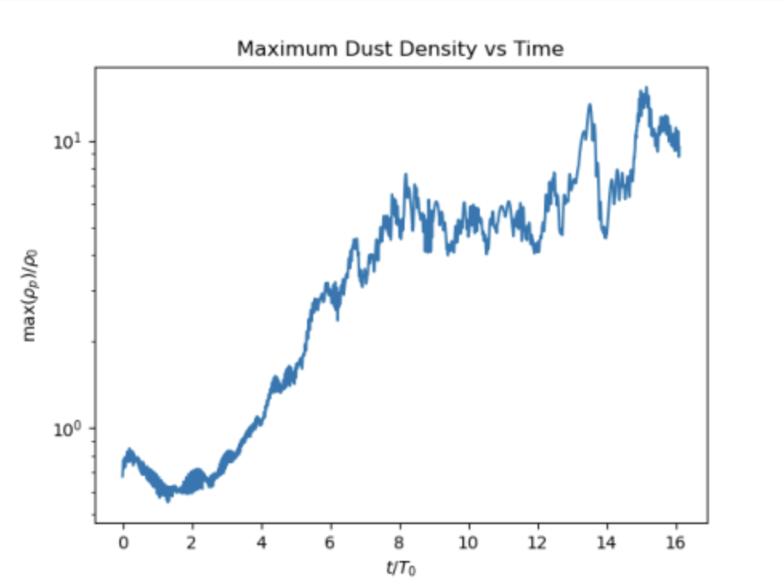
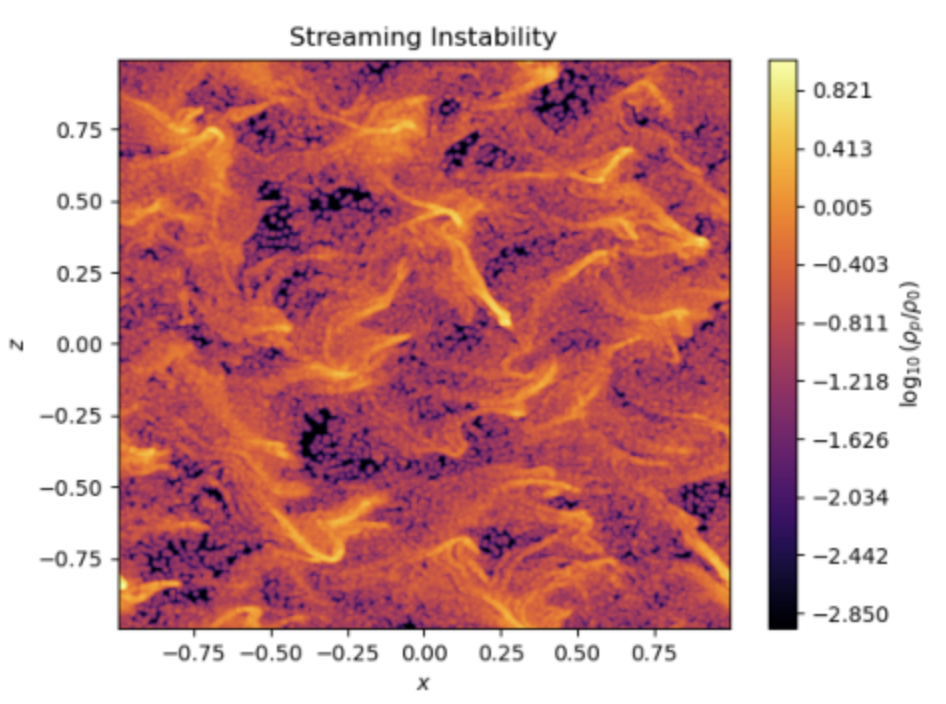

Now let us visualize the results. Let's read the time series and plot the maximum dust density vs time. 

A parenthetical comment. On the terminal, the PYTHONPATH variable sets the path to python. On the notebooks of https://jupyter.flatironinstitute.org/, you'll need the following lines

```
import sys
sys.path.insert(0, "/my/home/dir/pencil-code/python")
```

where `/my/home/dir` is your path to home. 

Conversely, if you are using python from the terminal, you will need to `ssh` into rusty via `ssh -Y rusty` after getting on the login to enable the X window. You will also need the following lines on the script 

```
import matplotlib
matplotlib.use('TkAgg')
```

The rest is the same for either jupyter notebook or terminal prompt

```
import pencil as pc
import numpy as np
import matplotlib.pyplot as plt

ts=pc.read.ts()
plt.plot(ts.t/2/np.pi,ts.rhopmax)

plt.xlabel(r'$t/T_0$')
plt.ylabel(r'max($\rho_p$)/$\rho_0$')
plt.yscale('log')
plt.title("Maximum Dust Density vs Time")
plt.show()
```

This should be the result. The abscissa is in orbital periods, the ordinate is maximum dust normalized by the reference gas density. 



Now let us inspect the a contour plot of the dust density. 

```
import pencil as pc
import numpy as np
import matplotlib.pyplot as plt

ff=pc.read.var(trimall=True)
rhop = ff.rhop[:,0,:]
amax = np.log10(rhop.max())
amin = amax - 4
rmin=10**amin
i = np.where(rhop < rmin) 
rhop[i] = rmin
plt.contourf(ff.x,ff.z,np.log10(rhop),np.linspace(amin,amax,256),cmap='inferno')

plt.xlabel(r'$x$')
plt.ylabel(r'$z$')
plt.colorbar(label=r"$\log_{\rm 10}(\rho_p/\rho_0)$")
plt.title("Streaming Instability")
plt.show()
```


